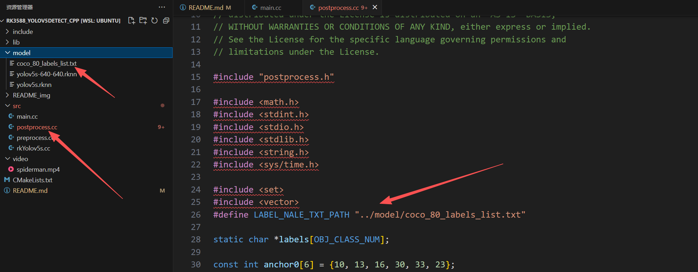
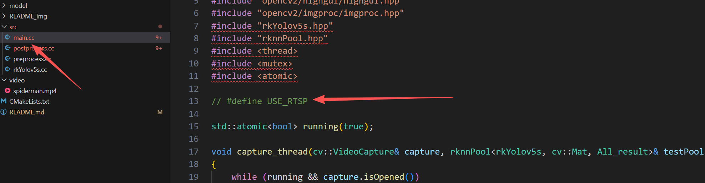
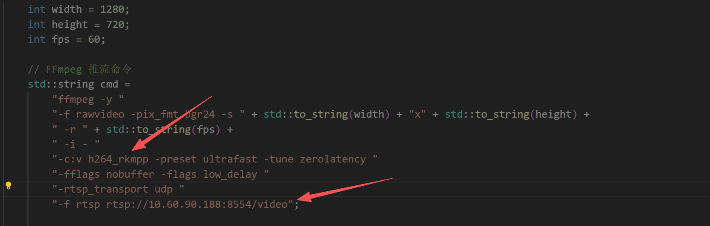

# RK3588实现线程池推理yolov5(C++版本)

这里提供了C++版本的yolov5线程池推理的代码，我已经把全部要用到的动态库环境一同放到此项目中，所以无需去安装opencv已经RKNN等各种环境，拉下即可直接编译运行

## 环境说明

### PC端（模型量化）

Python版本：conda环境，Python 3.10.16

操作系统：Ubuntu20.04 

rknn-toolkit2版本：Version: 2.0.0b0+9bab5682rknn-toolkit2版本：Version: 2.0.0b0 9bab5682

```bash
# 可以通过这个指令查看
pip3 show rknn-toolkit2
```

### 香橙派rk3588端

Python版本：Python 3.10.12

操作系统：Ubuntu20.04 （注意操作系统要是这个才行，因为我的opencv是在ubunt20.04操作系统编译的，不然链接的时候会报错）

NPU版本：RKNPU driver: v0.9.6（0.9.6版本的都兼容）

```bash
# 可通过下面这个查看
sudo cat /sys/kernel/debug/rknpu/version
```

rknn-toolkit-lite2：Version: 1.6.0

```bash
# 可以通过下面这个指令查看
pip3 show rknn-toolkit-lite2
```


## 运行案例

拉取仓库代码：

```bash
git clone https://github.com/Fitz8863/RK3588_yolov5detect_cpp.git
```

```bash
cd RK3588_yolov5detect_cpp
```

然后创建进入build目录

```bash
mkdir -p build && cd build
```

在build目录下执行cake

```bash
cmake ..
```

然后再执行make

```
make
```

可以看到生成了rknn_yolov5_demo 这个可执行程序，但是在此之前要执行下面这个语句，把库环境导入到当前终端中（注意，下面那个path改用你的绝对路径）

```bash
export LD_LIBRARY_PATH=$LD_LIBRARY_PATH:$(find /path/RK3588_yolov5detect_cpp/lib -type d | tr '\n' ':')
```

然后再执行案例（如果想使用摄像头，把../video/spiderman.mp4改成 /dev/video0 即可，根据你摄像头描述符号去改）

```bash
./rknn_yolov5_demo ../model/yolov5s-640-640.rknn ../video/spiderman.mp4
```

如果出现无法运行的情况，可能是一些依赖的问题，这边建议安装一下，下面这些依赖是我编译opencv的时候使用到的（可以正常运行的话就不用安装这些）
```bash
apt install -y libjpeg-dev libpng-dev libtiff-dev libwebp-dev libopenexr-dev
apt install libavcodec-dev libavformat-dev libavutil-dev libswscale-dev libswresample-dev
apt install libgstreamer1.0-dev libgstreamer-plugins-base1.0-dev
apt install libv4l-dev v4l-utils

apt install libgtk-3-dev
apt install libgl1-mesa-dev libglu1-mesa-dev
```


## 补充说明

### 1、识别的类别

这里有一个文本，这个文本是表示要识别的类别，如果你要去推理你自己的模型的话，记得修改一下这个文本里面的内容



### 2、关于推流和ffmpeg

可以看到main.cc主文件的这里，这里有一个编译宏，默认注释掉是表示不使用推流，使用直接在显示屏显示推理后的视频；如果解开注释的话就表示使用推流的形式。



下面这里是推流的指令，我是使用ffmpeg去推流的，这里需要设置推流的分辨率和帧率这些参数，这里你根据实际情况去设置就行了。还有就是 -c:v h264_rkmpp 这里是指定推流使用的H264流编码器 ，我这里指定是使用硬件编码也就是rk3588的 h264_rkmpp 编码器，如果你的设备不支持这个那请你把 h264_rkmpp 改成 libx264 就行了，这个是使用cpu默认编码。



这里我强烈建议你使用硬件编码去实现推流的操作。因为程序模型推理是属于非常吃开发板性能的，CPU软件编码本身就是很容易导致程序崩溃，具体教程可参考下面博客

> [rk3588 ffmpeg硬编码安装_rk3588 ffmpeg硬解码-CSDN博客](https://blog.csdn.net/qq_59164231/article/details/143510535)

